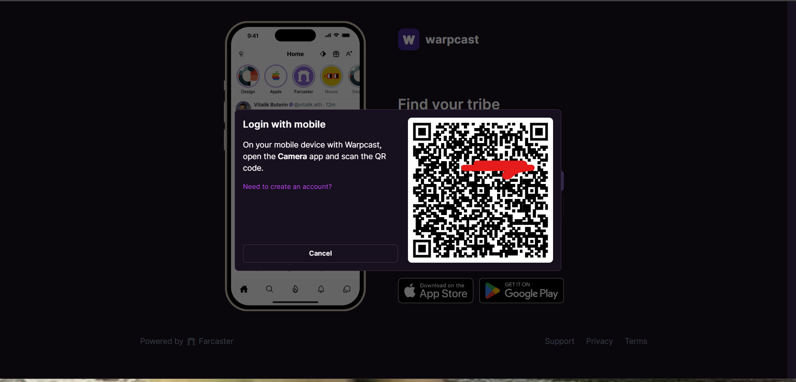
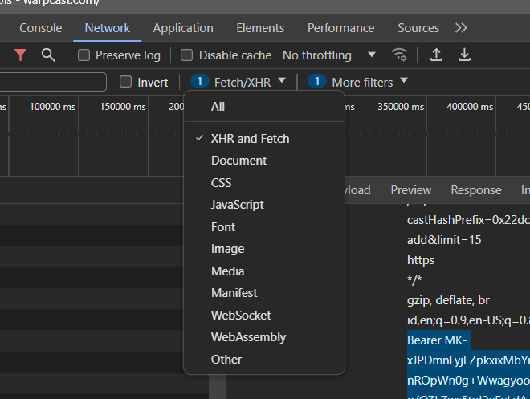
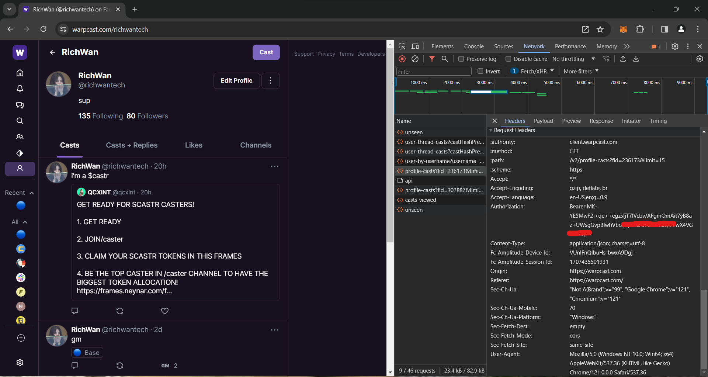
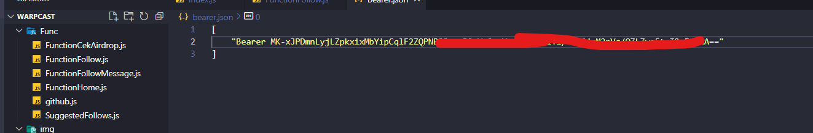
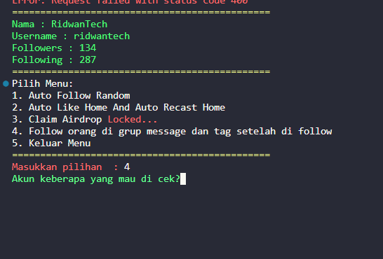
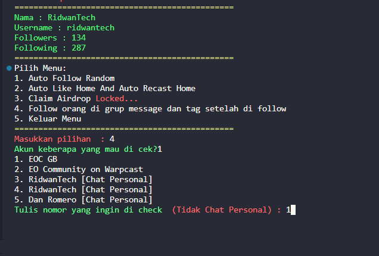
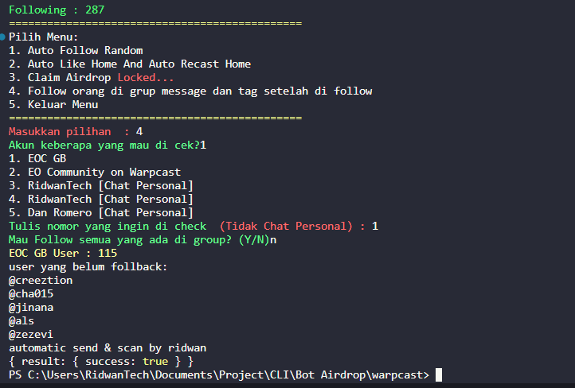
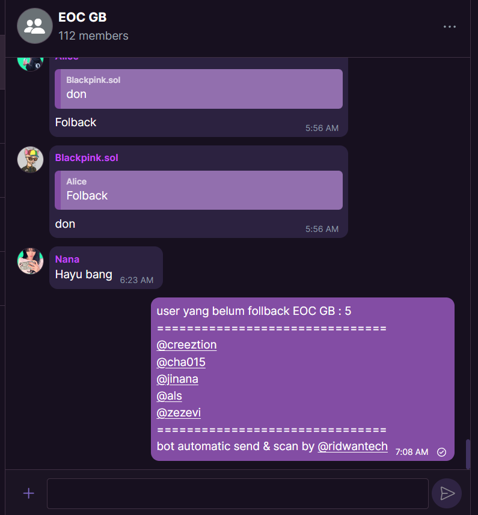

# Bot warpcast multi akun

## Cara Pakai

1. Clone repository ke local kalian / replit / github.dev
```bash
git clone https://github.com/mhrdwan/warpcast-bot-multi-akun
```

2. Masuk ke folder `warpcast-bot-multi-akun`
```bash
jika sudah di clone nanti akan ada folder bernama warpcast-bot-multi-akun masuk dan buka terminal (jika punya visual code , silahkan di buka)
```

3. Lakukan instalasi
```bash
npm install
```

4. Cari Token Akun Warpcast Kalian, buka `https://warpcast.com/` di browser pc kalian

5. Klik login dengan qr
   


6. Scan dengan aplikasi warpcast di hp kalian

7. Jika sukses login , maka akan masuk ke halaman utama warpcast kalian

8. jika sudah , langkah selanjutnya masuk ke halaman profile kalian.

9. ketik & tahan di keyboard kalian `CTRL + SHIFT + C` / klik kanan lalu inspect || Buka tab `Network` lalu filter `XHR and Fetch`
   

10. Lalu jika sudah muncul , refresh kembali browser kalian
11. kemudian di tab network akan muncul url profile-casts?id... click tab ini kemudian masuk ke headers scroll kebawah sampai kalian menemukan `Authorization` , kemudian copy valuenay dari `Bearer sampai selesai`
    
12. Copy Bearer kalian kemudian masukkan ke file `bearer.json` , jika kalian punya beberapa akun tinggal masukkan saja token dari masing masing akun kalian
    

13 . lalu start `npm start` nanti akan muncul menu 
    

  ## Contoh menu 4
- pilih menu 4
- pilh akun warpcast kalian
- nanti akan muncul grup kalian (jika kalian masuk grup) / join https://warpcast.com/~/group/EyENxh0_gGEkOPioD-MntQ
- pilih grup  jangan chat personal
  

- pilih follow semua akun digrup jika sudah follow semua , kembali lagi dengan ke tik `node .`  pilih no 4 , masukkan akun , pilih grup
- jika sudah , yang tadi kita pilih follow semua , sekarang kita ketik N 
    
- jika sukses akan muncul pesan sukses seperti di atas
- jika kita cek di grup maka akan muncul pesan untuk memfollback kita
  

# Jangan lupa untuk follow github https://github.com/mhrdwan dan star repository ini ✌️
## Do Your Own Research saya tidak bertanggung jawab jika akun kalian kenapa-kenapa 
# on working claim airdrop automatic
